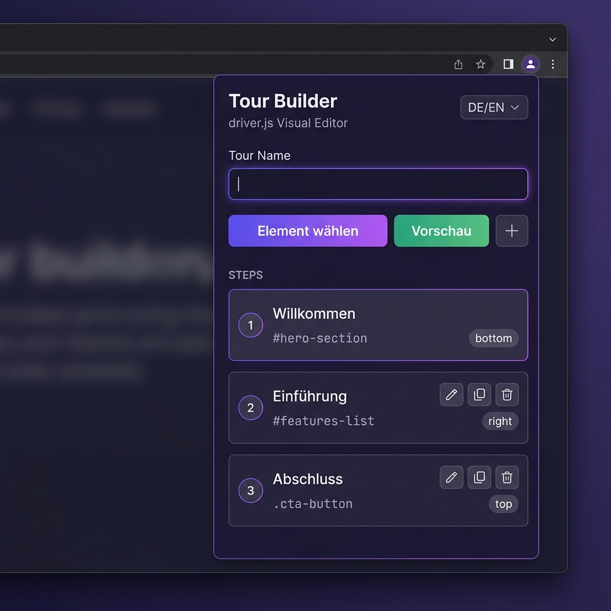
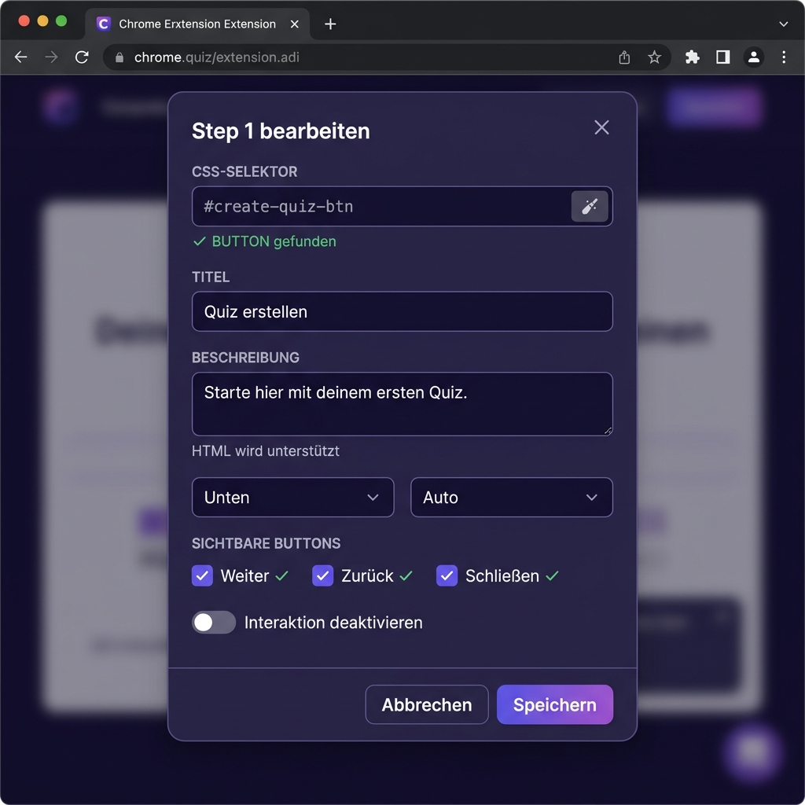

<p align="center">
  
</p>

<h1 align="center">🎯 Driver.js Tour Builder</h1>

<p align="center">
  <strong>Visual Chrome Extension for creating interactive product tours with <a href="https://driverjs.com/">driver.js</a></strong>
</p>

<p align="center">
  <a href="https://github.com/AnnilBerd/driver-tour-builder/releases/latest"></a>
  <a href="LICENSE"></a>
  
  
  
</p>

---

## ✨ Features

- **🖱️ Visual Element Picker** — Click any element on the page to add it as a tour step. Smart CSS selector generation prioritizes stable selectors (IDs, data attributes, ARIA labels).
- **📝 Step Editor** — Configure title, description, popover position, alignment, visible buttons, and CSS class per step.
- **↕️ Drag & Drop** — Reorder tour steps by dragging cards in the side panel.
- **⚙️ Global Settings** — Control animation, overlay, scroll behavior, keyboard navigation, button texts, and progress display.
- **▶️ Live Preview** — Test your tour directly on the current page without leaving the browser.
- **📤 Export** — Download as ready-to-use JSON or JavaScript code. Native OS save dialog lets you choose the file location.
- **📥 Import** — Load existing tour JSON files for editing.
- **📋 Clipboard** — Copy the tour config JSON directly to your clipboard.
- **🌍 Localization** — Full German and English UI. Auto-detects browser language.
- **💾 Auto-Save** — Your work is automatically persisted and restored between sessions.

---

## 📸 Screenshots

<table>
  <tr>
    <td align="center" width="33%">
      <br />
      <sub><b>Side Panel with Steps</b></sub>
    </td>
    <td align="center" width="33%">
      <br />
      <sub><b>Step Configuration Modal</b></sub>
    </td>
    <td align="center" width="33%">
      <br />
      <sub><b>Live Preview on Page</b></sub>
    </td>
  </tr>
</table>

---

## 🚀 Installation

### Option A: Download Release (Recommended)

1. Go to the [**Releases**](https://github.com/AnnilBerd/driver-tour-builder/releases/latest) page
2. Download the latest `driver-tour-builder-vX.X.X.zip`
3. Unzip it to a permanent folder on your machine
4. Open Chrome and navigate to `chrome://extensions/`
5. Enable **Developer Mode** (toggle in the top-right corner)
6. Click **"Load unpacked"** and select the unzipped folder
7. The Tour Builder icon appears in your toolbar ✓

### Option B: Clone from Source

```bash
git clone https://github.com/AnnilBerd/driver-tour-builder.git
cd driver-tour-builder
```

Then load the folder in Chrome as described above (steps 4–7).

---

## 📖 Usage

### Creating a Tour

1. **Open the extension** — Click the Tour Builder icon in your Chrome toolbar to open the side panel.
2. **Pick elements** — Click "Pick Element" (or "Element wählen"), then hover over and click any element on the page.
3. **Configure the step** — Set title, description, popover position, and which buttons to show.
4. **Add more steps** — Repeat or use the "+" button for manual entries.
5. **Reorder** — Drag and drop step cards to arrange the tour sequence.
6. **Preview** — Click "Preview" to test the tour live on the page.

### Exporting

| Action | Description |
|---|---|
| **Export JSON** | Saves the tour config as a `.json` file via OS save dialog |
| **Export Code** | Saves a ready-to-use `.js` file with import statements |
| **Copy to Clipboard** | Copies the JSON config to your clipboard |

### Using the Exported Code

```javascript
import { driver } from "driver.js";
import "driver.js/dist/driver.css";

const tourConfig = {
  showProgress: true,
  steps: [
    {
      element: "#welcome-btn",
      popover: {
        title: "Welcome!",
        description: "Click here to get started.",
        side: "bottom",
        align: "center"
      }
    },
    {
      element: ".dashboard-nav",
      popover: {
        title: "Navigation",
        description: "Browse through sections here."
      }
    }
  ]
};

const driverObj = driver(tourConfig);
driverObj.drive();
```

---

## 🏗️ Project Structure

```
driver-tour-builder/
├── manifest.json               # Chrome Extension Manifest V3
├── background/
│   └── service-worker.js       # Message routing, script injection, storage
├── content/
│   ├── picker.js               # Element picker (inspector mode)
│   └── preview.js              # Live preview coordination
├── sidepanel/
│   ├── sidepanel.html          # Side panel GUI structure
│   ├── sidepanel.css           # Premium dark theme styles
│   ├── sidepanel.js            # Step management, export/import logic
│   └── i18n.js                 # Internationalization (DE/EN)
├── lib/
│   ├── driver.js.iife.js       # driver.js v1.3.1 (IIFE bundle)
│   └── driver.css              # driver.js styles
├── icons/
│   ├── icon16.png
│   ├── icon48.png
│   └── icon128.png
├── docs/
│   └── screenshots/            # README screenshots
├── .github/
│   └── workflows/
│       └── release.yml         # Automated release builds
├── LICENSE                     # MIT License
├── CHANGELOG.md                # Version history
└── CONTRIBUTING.md             # Contribution guidelines
```

---

## 🧪 Technical Details

### Selector Strategy

The element picker generates robust CSS selectors using this priority:

1. **`#id`** — Stable element IDs (dynamic IDs like React-generated ones are detected and skipped)
2. **`[data-tour]`, `[data-test]`, `[data-testid]`** — Testing/tour data attributes
3. **`[aria-label]`** — Accessibility attributes (if unique)
4. **`tag.stable-class`** — Tag name with stable CSS classes (CSS Modules, Emotion, Styled Components classes are filtered out)
5. **Path selector** — Full DOM path as fallback

### CSP Compatibility

The preview system uses `chrome.scripting.executeScript` with `world: 'MAIN'` to inject and run driver.js. This **bypasses Content Security Policy** restrictions entirely, as it's a privileged Chrome API — no inline scripts are created.

### Permissions

| Permission | Purpose |
|---|---|
| `sidePanel` | Opens the Tour Builder UI |
| `activeTab` | Access to the current tab for element picking |
| `scripting` | Inject picker/preview scripts into pages |
| `storage` | Auto-save tour drafts and language preference |

---

## 🌍 Internationalization

The extension supports **German** and **English**. The language selector is in the top-right corner of the side panel.

- Language is auto-detected from your browser settings on first launch
- Your choice is persisted across sessions
- All UI labels, tooltips, placeholders, and toast messages are translated

---

## 🤝 Contributing

Contributions are welcome! Please read the [Contributing Guidelines](CONTRIBUTING.md) before submitting PRs.

---

## 📄 License

This project is licensed under the **MIT License** — see the [LICENSE](LICENSE) file for details.

---

## 🙏 Acknowledgements

- [driver.js](https://driverjs.com/) by [Kamran Ahmed](https://github.com/kamranahmedse) — the excellent tour library this tool builds upon
- [Inter](https://rsms.me/inter/) & [JetBrains Mono](https://www.jetbrains.com/lp/mono/) — typefaces used in the UI
